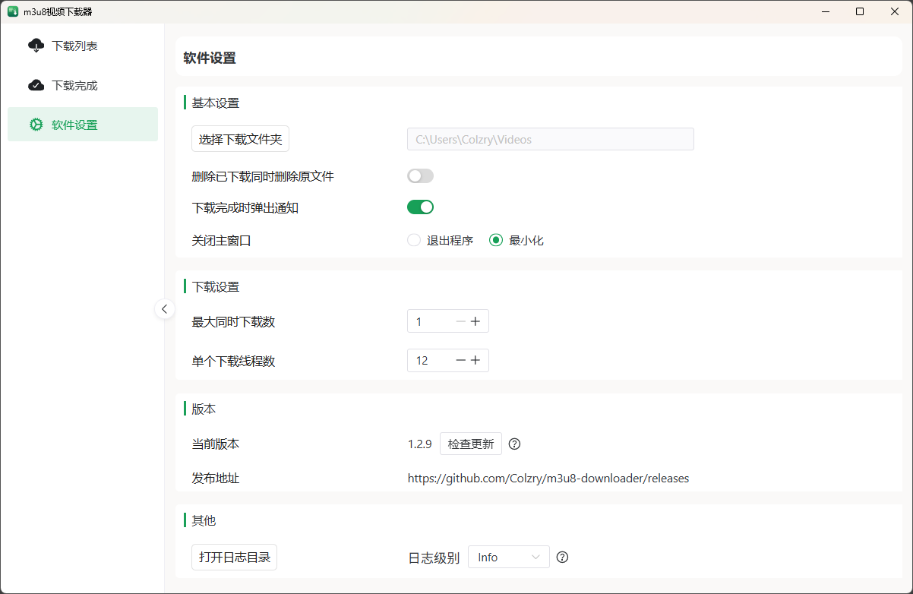

# m3u8下载器


<br/>




## 下载
[点击去下载使用](https://github.com/Colzry/m3u8-downloader/releases)

m3u8测试下载地址：https://sf1-cdn-tos.huoshanstatic.com/obj/media-fe/xgplayer_doc_video/hls/xgplayer-demo.m3u8

## 项目简介
该项目是基于 Rust + Tokio + Tauri 构建的高性能 M3U8 视频下载器桌面应用。实现了以下功能：
- 支持 M3U8 地址解析和分片下载
- 自动识别并解密 AES-128 编码的 ts 分片
- 支持控制并发大小
- 实时显示下载速度与进度
- 使用 FFmpeg 合并 .ts 到最终 .mp4 文件
- 支持暂停、恢复、取消下载任务
- 自动验证 ts 分片格式有效性，防止无效文件污染合并结果
- 断点续传下载支持，程序重启后能精确从上次的分片下载开始，保证恢复下载的一致性
- 智能重试策略，引入指数退避和随机抖动机制，大幅提高了网络波动下的下载成功率
- 支持自定义请求头（Custom Headers），可添加Referer、User-Agent、Cookie等HTTP头部信息，绕过网站反爬虫限制

## 深链协议（m3u8dl://）

安装后应用会注册 `m3u8dl://` 自定义协议，凡以该前缀开头的链接都会由本工具接管打开，可用于从脚本/浏览器一键唤起下载。

**协议格式**（`url` 与 `name` 均需 URL 编码）：

```text
m3u8dl://add?url=<m3u8下载地址>&name=<视频名称>
```

| 参数 | 必填 | 说明 |
| --- | --- | --- |
| `url` | 是 | m3u8 下载地址，必须以 `http://` 或 `https://` 开头 |
| `name` | 否 | 视频名称；缺省时自动从 url 文件名推导 |

**示例**：

```text
m3u8dl://add?url=https%3A%2F%2Fexample.com%2Fvideo%2Findex.m3u8&name=%E6%B5%8B%E8%AF%95%E8%A7%86%E9%A2%91
```

触发后应用会被唤起并置顶，默认会打开「新建下载」界面并预填地址与名称，由用户确认后再下载。若在「软件设置 → 下载设置」中开启「深链链接直接开始下载」，则会跳过确认直接加入列表并开始下载。若应用已在运行，则复用当前实例；若处于托盘/最小化状态，会自动恢复并置顶窗口。

> 注意：请务必对 `url` 做 URL 编码，否则地址中自带的 `&`、`?` 等字符会被误解析。

## 技术栈
### 后端 :

- Rust: 提供内存安全和高性能的底层支持。
- Tokio: 业界领先的 Rust 异步运行时。
- Reqwest: 功能强大且易于使用的 HTTP 客户端。
- Serde: 高效的 Rust 数据结构序列化/反序列化框架。
- FFmpeg: 作为外部依赖，用于 .ts 文件校验和最终的视频合并。

### 前端 & 桌面框架:

- Tauri: 使用 Web 技术构建轻量、快速、安全的桌面应用的框架。
- Vue3: 构建用户界面的渐进式 JavaScript 框架，采用 Composition API 提供更灵活、高效的开发体验。
- Vite: 新一代前端构建工具，提供极速冷启动、即时热更新，显著提升 Vue 应用的开发效率和用户体验。
- NaiveUI: 一套基于 Vue 3 和 TypeScript 的高质量组件库，风格简洁现代，提供丰富的开箱即用组件（如按钮、表格、弹窗等），完美适配管理系统和工具类应用。
- Pinia: Vue 的新一代状态管理方案，相比 Vuex 更加类型友好、模块化清晰且易于使用，适用于中大型项目的全局状态管理。

## 开发环境准备
### 安装必要工具链：
 - Rust 工具链 安装 [Rust](https://www.rust-lang.org/zh-CN/tools/install) (rustup)
- Node.js & 包管理器 (pnpm/yarn/npm)
- tauri/cli:
`npm install -g @tauri-apps/cli`

## 快速启动 & 运行项目
```bash
# 克隆仓库
git clone https://github.com/Colzry/m3u8-downloader.git
cd m3u8Downloader
# 安装 JS 依赖
yarn install    # 或 yarn, pnpm
# 启动开发模式（自动打开窗口）
yarn tauri dev
```

## 构建与打包（生产）
```bash
# 生产打包
yarn tauri build

# 输出位置：
src-tauri/target/release/bundle/
```


## 贡献指南
欢迎任何形式的贡献！如果你想为这个项目做出贡献，请遵循以下步骤：

1. Fork 本仓库。
2. 创建一个新的功能分支 `git checkout -b fix/an-issue`
3. 提交你的修改 `git commit -m 'fixed an issue'`
4. 将你的分支推送到你的 Fork `git push origin fix/an-issue`
5. 提交一个 Pull Request 描述你的更改内容

## 许可证
本项目基于 GPL-3.0 许可证开源。

Copyright ©️2025 Colzry
